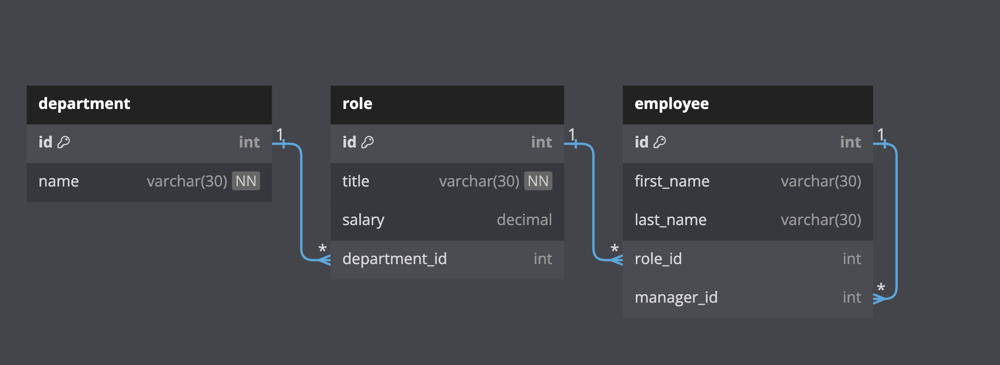

# Employee Database
  

  ## Description
  
  Command Line Interface Application to manager employee roles.

  Diagram of SQL Database used
  

  Link to video of application demo ⤵️
  

  ## Table of Contents
  * [Installation](#installation)
  * [Usage](#usage)
  * [License](#license)
  * [Contribute](#contribute)
  * [Testing](#testing)
  * [Questions](#questions)
  
  ## Installation
  You will need to install the following to use this project

  `inquirer` & `mysql2`

  ## Usage

  The use case for this project is Tracking the positions that employees currently have, adding employees and updating them.

  ## License

  This Project is licensed under [MIT](https://opensource.org/licenses/MIT)

  ## Contribute

  If you would like the help contribute to this project contact GitHub Repo

  ## Testing

  To test this project do the following,

  Clone repo to machine. Run the command `npm install` then `node index.js`

  ## Questions
  
  For any questions related to this project contact Use [Github](https://github.com/Olegreg762) or [Linkedin](https://www.linkedin.com/in/greg-stevenson-422931a9) 
  You can see more of my work on my Github [Olegreg762](https://github.com/Olegreg762)
